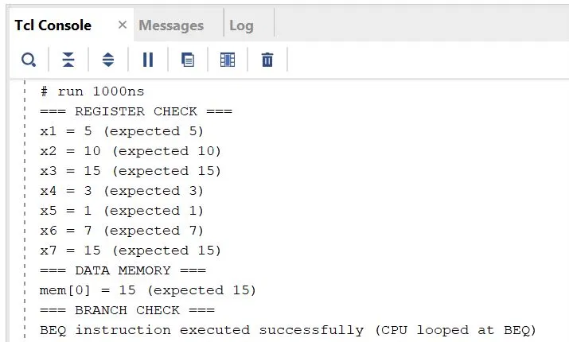
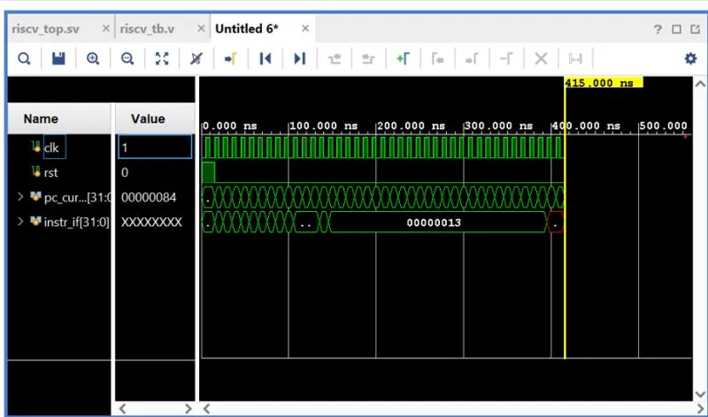

# 5-Stage Pipelined RISC-V RV32I Processor

A fully functional 5-stage pipelined RISC-V RV32I processor core implemented in SystemVerilog, featuring hazard detection, data forwarding, and a self-checking testbench.

## Project Overview

This project implements a complete pipelined CPU from scratch, including:
- Full 5-stage pipeline (IF, ID, EX, MEM, WB)
- Data forwarding unit for RAW hazard resolution
- Hazard detection unit for stall and flush control
- Self-checking testbench for functional verification

## Architecture

Pipeline stages: IF to ID to EX to MEM to WB. Four pipeline registers (IF/ID, ID/EX, EX/MEM, MEM/WB) separate the stages. A Forwarding Unit and a Hazard Unit operate across the EX stage to resolve data and control hazards.

## Module Structure

| Module | File | Description |
|--------|------|-------------|
| Program Counter | riscv_sv.sv | Tracks next instruction address |
| Instruction Memory | instr_mem.sv | ROM storing all instructions |
| IF/ID Register | if_id_reg.sv | Pipeline register IF to ID |
| Control Unit | control_unit.sv | Generates all control signals |
| Register File | register_file.sv | 32 general purpose registers |
| ID/EX Register | id_ex_reg.sv | Pipeline register ID to EX |
| ALU | alu.sv | Arithmetic Logic Unit |
| ALU Control | alu_control.sv | ALU operation decoder |
| EX/MEM Register | ex_mem_reg.sv | Pipeline register EX to MEM |
| Data Memory | data_mem.sv | RAM for load/store |
| MEM/WB Register | mem_wb_reg.sv | Pipeline register MEM to WB |
| Forwarding Unit | forwarding_unit.sv | RAW hazard resolution |
| Hazard Unit | hazard_unit.sv | Stall and flush control |
| Top Module | riscv_top.sv | Connects all modules |
| Testbench | riscv_tb.v | Self-checking verification |

## Instructions Verified

| Instruction | Operation | Result |
|-------------|-----------|--------|
| ADDI x1, x0, 5 | x1 = 5 | Pass |
| ADDI x2, x0, 10 | x2 = 10 | Pass |
| ADD x3, x1, x2 | x3 = 15 | Pass |
| ADDI x5, x0, 3 | x5 = 3 | Pass |
| AND x6, x1, x5 | x6 = 1 | Pass |
| OR x7, x1, x5 | x7 = 7 | Pass |
| SW x3, 0(x0) | mem[0] = 15 | Pass |
| LW x8, 0(x0) | x8 = 15 | Pass |
| BEQ x1, x1, 0 | branch executed | Pass |

## Simulation Results

Register verification (Tcl Console):

Waveform (Vivado):

## Tools Used

- Language: SystemVerilog
- Simulator: Xilinx Vivado XSim
- ISA: RISC-V RV32I
- Clock: 100 MHz

## Key Concepts Implemented

### Data Forwarding
Resolves RAW (Read After Write) hazards by bypassing results directly from the MEM/WB stages to the EX stage ALU inputs without stalling.

### Hazard Detection
- Load-use hazards: inserts a 1-cycle stall
- Branch hazards: flushes the pipeline with NOP bubbles

### Pipeline Registers
Four pipeline registers (IF/ID, ID/EX, EX/MEM, MEM/WB) with stall and flush support for correct hazard control.

## How to Run

1. Open Xilinx Vivado
2. Create a new RTL project
3. Add all .sv design files as Design Sources
4. Add riscv_tb.v as a Simulation Source
5. Run Behavioral Simulation
6. Check the Tcl Console for verification results

## Author

Shruddha Metri  
